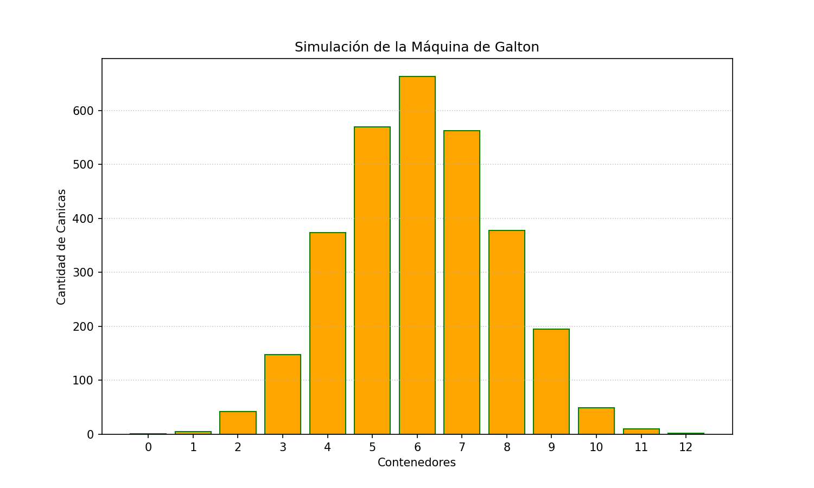

# Maquina de Galtón

### Objetivo.

> El objetivo principal de este proyecto es simular una máquina de Galton para ilustrar de forma práctica un concepto fundamental de la probabilidad.  A través de la simulación de 3,000 canicas cayendo por 12 niveles de obstáculos, el programa demuestra que, aunque el camino de cada canica es completamente aleatorio, el resultado final de la distribución de las canicas en los contenedores sigue un patrón predecible en forma de curva de campana.

## Funciones

> A continuación describire que hace cada función en mi programa.

### count_files_in_directory

> Esta función determina el numero de archivos/subdirectorios contiene una carpeta, esto con el fin de poder otorgar un nuevo nombre a el gráfico que se creara para representar la Maquina de Galtón. Se utilizara la libreria os para poder tener acceso a las carpetas y adquirir el numero de archivos/subdirectorios que contenga.

### simulate_galton_machine

> Esta función realiza toda la simulación de nuestro programa, utilizando la librería numpy y el objeto Counter de la libreria collections. Con numpy adquirimos el array que contiene los 3000 resultados que vendrian a ser las 3000 pelotitas de nuestra maquina de galton, con el metodo np.random.binomial determinamos que solo hay 2 opciones, izquierda o derecha, creamos un numero aleatorio basado en 12 decisiones aleatorias. Counter nos devuelve un objeto de tipo Counter que funciona como un diccionario, cuenta todos loselementos que se repiten y los asigna como valor, mientras que el numero contado se almacena como clave, esto es escencial para posteriormente hacer nuestro grafico. Por ultimo transformamos nuestro objeto Counter en un diccionario.

### plot_histogram

> Esta funcion nos ayuda a realizar el gráfico, nos solicita la información y la ruta donde se almacenara el archivo png. Primero ordenareos nuestros datos por clave, recordando que la clave son los numeros aleatorios adquiridos en nuestra funcion simulate_galon_machine, los cuales van del 0 al 12. Despues ordenamos en una nueva lista el conteo de nuestros valores. Creamos el grafico y le pasamos nuestra información, el numero de barras y sus valores respecivamente, asignamos los colores y los ejes x,y, asignamos nombre a las etiquetas, creamos una cuadricula para simular la maquina de Galton y guardamos nuestro gráfico en la ruta determinada.

> 

### Conclusiones

> En esta ocasión aprendi a reutilizar más codigo de librerias ya establecidas para hacer mi programa de una manera más eficiente, ademas el documetar cada parte de mi codigo con las comillas triples me fue de mucha ayuda para comprender de forma más rapida mi programa al momento de documentar, el leer documentación de numpy y ver los ejemplos para el desarrollo del proyecto, me brindo las herramientas para su total realización, por lo cual aprendí que a pesar de ser tedioso, el leer la documentación ahorra bastante tiempo de desarrollo. Otra herramienta que me ayudo bastante fue el Typear mi codigo con typing, hace que cada funcion sea mucho más entendible, sabiendo que se solicita y que retorna.
